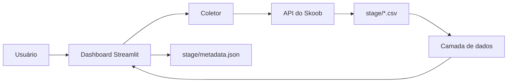

# Skoob Dashboard

Dashboard em Streamlit para visualizar a estante do Skoob, acompanhar a meta de leitura atual e analisar livros lidos, autores, editoras e progresso.

## Funcionalidades

- Histórico completo de livros por usuário.
- Visão da meta de leitura atual.
- Filtros por ano e status.
- KPIs de livros, páginas lidas e ritmo de leitura.
- Gráficos de leituras ao longo do tempo, autores e editoras.
- Top 10 livros melhor avaliados.
- Análise dos livros pendentes da meta atual, incluindo páginas restantes e pace necessário até o fim do ano.
- Cadastro, edição e exclusão de usuários pela página de gerenciamento.
- Atualização dos dados diretamente pela dashboard.

## Requisitos

- Python 3.10 ou superior.
- Um token válido da API do Skoob.

## Instalação

Clone ou abra o repositório e crie um ambiente virtual:

```bash
python -m venv venv
source venv/bin/activate
```

Instale as dependências:

```bash
pip install -r requirements.txt
```

No Windows, ative o ambiente com:

```powershell
venv\Scripts\activate
```

## Configuração

Edite `config.py` e informe um token válido no campo `TOKEN`.

Não compartilhe o token nem o mantenha versionado em repositórios públicos. Para produção, prefira carregar o token por variável de ambiente ou secret manager.

Os usuários são cadastrados pela interface e armazenados em:

```text
stage/metadata.json
```

O arquivo contém o cadastro, o status da última atualização e o campo `updated_at`.

## Executando a dashboard

Com o ambiente virtual ativado, execute:

```bash
streamlit run load_data.py
```

Abra o endereço exibido pelo Streamlit, normalmente:

```text
http://localhost:8501
```

A dashboard começa sem usuário selecionado. Escolha um usuário na sidebar para visualizar os dados.

## Páginas

### Dashboard

Arquivo de entrada: `load_data.py`.

A página permite alternar entre:

- **Histórico Completo**: análises dos livros lidos na estante completa.
- **Meta de Leitura Atual**: livros da resposta da meta atual, incluindo livros em leitura e ainda não iniciados.

### Gerenciamento de usuários

Arquivo: `pages/usuarios.py`.

Use o botão **Gerenciar usuários** na sidebar para:

- Adicionar um usuário informando nome e ID.
- Editar o nome de um usuário.
- Excluir um usuário e seus arquivos CSV armazenados em `stage/`.

## Atualização dos dados

Na dashboard, selecione um usuário e clique em **Atualizar dados**. A coleta é executada em segundo plano e a página permanece em estado de carregamento até finalizar.

Também é possível executar a coleta manualmente:

```bash
python main.py --user-id ID_DO_USUARIO
```

Ou diretamente pelo módulo de coleta:

```bash
python -m data_collection.collector --user-id ID_DO_USUARIO
```

A coleta gera dois arquivos separados:

```text
stage/all_books_<user_id>.csv
stage/goal_books_<user_id>.csv
```

- `all_books`: histórico completo da estante.
- `goal_books`: livros retornados pela meta de leitura atual.

Os CSVs usam `|` como separador.

## Estrutura do projeto

```text
.
├── config.py                    # Configurações, token, caminhos e API
├── load_data.py                 # Entrada principal da dashboard
├── main.py                      # Compatibilidade para executar a coleta
├── requirements.txt             # Dependências Python
├── data_collection/
│   ├── api.py                   # Cliente e paginação da API do Skoob
│   ├── collector.py             # Coleta e gravação dos CSVs
│   └── storage.py               # Metadata e CRUD de usuários
├── frontend/
│   ├── charts.py                # Gráficos e análises visuais
│   ├── data_layer.py            # Leitura, limpeza e processamento dos dados
│   └── ui_components.py         # CSS e componentes reutilizáveis
├── pages/
│   └── usuarios.py              # Página de gerenciamento de usuários
├── stage/
│   ├── metadata.json            # Usuários e estado das atualizações
│   └── *_books_<user_id>.csv    # Dados coletados por usuário
└── .streamlit/
    └── config.toml              # Configurações do Streamlit
```

## Fluxo de dados



## Observações

- A data de atualização é armazenada em UTC e exibida na interface em UTC-3.
- O histórico anual considera livros com status `read`.
- A meta atual considera os status retornados pela API, incluindo `reading`, `want_to_read` e `to_read`.
- Ao excluir um usuário pela página de gerenciamento, o cadastro e os CSVs correspondentes são removidos.
- O Streamlit pode manter estado de widgets durante a sessão; uma nova coleta altera `updated_at` e força a atualização do cache dos dados.
